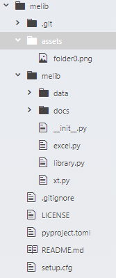
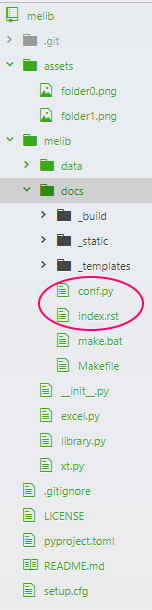
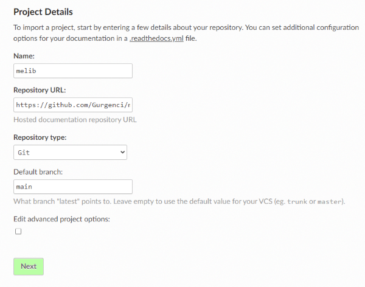
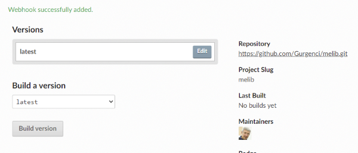
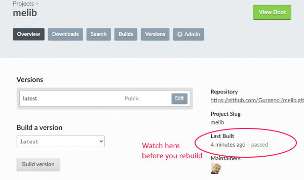

`pip install melib`

Documentation : https://melib.readthedocs.io/en/latest/

There are three files in this package:

* library.py -- a collection of small functions that can be used to execute small tasks associated with the design of mechanical components such as belts and chains, gears, rotating shafts, keys, bearings, welded joints, welded structures, fasteners, etc.  The module is designed to be used in teaching machine element design to second-year mechanical students. To motivate learning of procedures and relevant standards, there are no pushbutton complete designs. Unless otherwise specified, the formula and data reference is ‘Machine Elements in Mechanical Design’ by Mott.  There is a collection of Excel data files that are accessed by the library. These files are in the data folder. This is not a comprehensive machine design library but sufficient for preparing assignments, examples and exam questions.
* xt.py -- Functions that can be called upon to generate jupyter notebooks for documenting the mechanical design tasks. It also has functions to create pdf documents
* excel.py -- functions to read and write Microsoft Excel files. It uses the python package openpyxl.

This was the first project I registered in `PyPi` uploaded to `GitHub` with documentation atuomatically generated using `ReadTheDocs`.
I document every step to help others and future self in similar endeavours.

# Construct local repository #
I create a local folder `melib` and copy `LICENSE`, `pyproject.toml` and `setup.cfg` into this folder.
* `mkdir melib`
* `cd melib`
* `copy` the python libraries and the `data` folder into `melib`
* `mkdir docs`

This is the folder structure at this stage:



* `cd docs`
* `sphinx-quickstart`
```
  Separate source and build directories (y/n)[n]: Pick the default ([n])  
  Project name: hgdemo  
  Author name(s): H Gurgenci  
  Project release []: June 2021  
  Project language [en]: __  
```
This creates an intial directory structure as seen below:



The next step is to edit the files `index.rst` and `conf.py` (they are two files sphinx
created in the `docs` folder and are marked in the figure above.
We will also create a new file `api.rst` in the same folder.  Incidentally, the VS Code,
did not automatically update the folder pane after `sphinx-quickstart`.  One needs
to refresh to see the new files and folders in `docs`.

__index.rst__
This is the file after I edit it:
```
.. melib documentation master file, created by
   sphinx-quickstart on Tue Jun  8 09:34:23 2021.

Welcome to melib's documentation!
=================================
The melib package has three files: library, xt, and excel.
The first one is a library of functions that can be used
to do machine element design computations.  It was created
to help teach a second year design course at the University
of Queensland.

.. toctree::
   :maxdepth: 2
   :caption: Contents:

   api.rst


Indices and tables
==================

* :ref:`genindex`
* :ref:`modindex`
* :ref:`search`
```
__conf.py__
First, I add the path for the package files:

```
import os
import sys
sys.path.insert(0, os.path.abspath('..'))
```
Then the extensions.  I copied the extension list from the `conf` file in the `psf/requests`
repository on github.  I probably did not need them all.  Anyway, here they are.
```
extensions = [
    "sphinx.ext.autodoc",
    "sphinx.ext.intersphinx",
    "sphinx.ext.todo",
    "sphinx.ext.viewcode",
]
```
__api.rst__
This is a new file:
```
melib API reference
===================

.. module:: melib

.. automodule:: melib.library
    :members:

.. automodule:: melib.xt
    :members:

.. automodule:: melib.excel
    :members:

The data folder has design data that are needed by the functions in the library.py file.
```
Before running `./make html` to generate the local documentation pages, I copy the
image files I need into the `assets` folder.  These image files are referred to
by doc strings in the `library` and `xt` files.  For example, the reference to
the file `shoulderscf.png` in `library.py` is
```
            .. image:: ../../assets/shoulderscf.png
```
The local addressing is all with respect to the `docs` folder.

This completes the local documentation.  Let us now generate a `github` repository.

# Construct remote repository #
`git add -A`<br>
`git commit -am` 'the first commit'<br>
`git branch -M main`<br>
`git remote add origin https://github.com/Gurgenci/melib.git`<br>
`git push -u origin main`

# Remote documentation #
I will generate documentation using `ReadtheDocs`.  For a package like `melib` that
needs to import other packages, the dependencies need to be stated up front.  Otherwise,
`ReadtheDocs` will fail.

I create a new file called `requirements.txt` in the `docs` folder:
```
numpy>=1.0
pylatex>=1.0
openpyxl>=1.0
```
Now add this file to the `git` repository:

`git add -A`<br>
`git commit -am 'with the new file requirements.txt'`<br>
`git push -u origin main`

* Log in to `ReadtheDocs.org`
* Import a repository (melib should appear as an available option)
The import click will invoke the following menu.




Simply press the `Next` button to get to



Then click on the `Build version` button.  When the `Build` is finished, click
on the `View docs` button.

Unfortunately, this did not work.  The document generator failed to import my
files `library`, `xt`, and `excel` and issued the following warnings:

```
WARNING: autodoc: failed to import module 'library' from module 'melib'; the following exception was raised:
No module named 'numpy'
WARNING: autodoc: failed to import module 'xt' from module 'melib'; the following exception was raised:
No module named 'pylatex'
WARNING: autodoc: failed to import module 'excel' from module 'melib'; the following exception was raised:
No module named 'openpyxl'
looking for now-outdated files... none found
```
This was a surprise because I tested the use of a `requirements.txt` in a
simpler package, `hgdemo`.  There, `ReadtheDocs` managed to import a module that \
referenced `numpy` after I included a `requirements.txt` file with a `numpy` line.

This approach did not work for `melib`.

I decided to try an approach suggested in http://blog.rtwilson.com/how-to-make-your-sphinx-documentation-compile-with-readthedocs-when-youre-using-numpy-and-scipy/.  The suggestion is to include the following code at the top of the `conf.py` file:
```
import mock

MOCK_MODULES = ['numpy', 'scipy', 'matplotlib', 'matplotlib.pyplot', 'scipy.interpolate',
                'pylatex', 'openpyxl']
for mod_name in MOCK_MODULES:
    sys.modules[mod_name] = mock.Mock()
```
This made the `No module named 'pylatex'` and similar messages disappear from the `raw log`.
But the documentation still did not include anything on `library`, `xt` and `excel` contents.

I then realised that it is not enough to _mock_ a package but you need to _mock_
every module you import from it.  For example, for `pylatex.utils` you get
```
No module named 'pylatex.utils'; 'pylatex' is not a package
```


Incidentally, when you do a `rebuild` in ReadtheDocs, you must make sure that ReadtheDocs
is project database is updated with your latest `git push`.  Otherwise, `Build Docs`
will fail and it is an ugly process to recover from it.  So make sure that the
time since last built is as you expect it:



If all works well, the documentation will be created on http://hgdemo.readthedocs.io/
